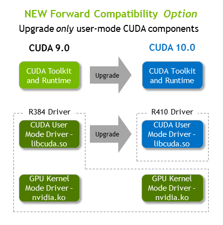

# Setup a Fresh GPU Machine

Instructions and support files to setup a fresh GPU machine

## Check the ubuntu version
```
lsb_release -a
```

## Verify if have CUDA-Capable GPU
```
lspci | grep -i nvidia
```

## Install NVIDIA Driver & CUDA
Things that matter
1. NVIDIA Driver version
2. CUDA version

You are most likely to install the latest version of the NVIDIA drivers which would be 410.xx  
In that case, you could install CUDA10.0. In case you already have NVIDA driver installed 
and if it is 390.xx, you may have to either upgrade to 410.xx or install CUDA9.0  
Please refer this [site]('https://docs.nvidia.com/deploy/cuda-compatibility/index.html') 
for the compatibility related doubts. The image below also depicts the same.

  

Now install the NVIDIA Driver  

Add repository
```
sudo add-apt-repository ppa:graphics-drivers/ppa
```

Install the key
```
sudo apt-key adv --fetch-keys  http://developer.download.nvidia.com/compute/cuda/repos/ubuntu1804/x86_64/7fa2af80.pub
```

Add NVIDIA repos
```
sudo bash -c 'echo "deb http://developer.download.nvidia.com/compute/cuda/repos/ubuntu1804/x86_64 /" > /etc/apt/sources.list.d/cuda.list'

sudo bash -c 'echo "deb http://developer.download.nvidia.com/compute/machine-learning/repos/ubuntu1804/x86_64 /" > /etc/apt/sources.list.d/cuda_learn.list'
```

Update the system
```
sudo apt update
```

Install CUDA
```
sudo apt install cuda-10-1
```
**Note**: This should be installing NVIDIA driver 410.xx also with it

## Install cudnn

```
sudo apt install libcudnn7
```

Add following lines into ~/.profile file for using CUDA 10.1

```
# set PATH for cuda 10.1 installation
if [ -d "/usr/local/cuda-10.1/bin/"  ]; then
    export PATH=/usr/local/cuda-10.1/bin${PATH:+:${PATH}}
    export LD_LIBRARY_PATH=/usr/local/cuda-10.1/lib64${LD_LIBRARY_PATH:+:${LD_LIBRARY_PATH}}
fi
```

## Important Note
**Reboot your computer for these changes to take effect properly**

## Verify the installation
The below command should show the Driver and CUDA version and the GPU device details
```
nvidia-smi
```

The below command should show the CUDA version and other CUDA related details
```
nvcc --version
```

The below command should display the cudnn version
```
/sbin/ldconfig -N -v $(sed 's/:/ /' <<< $LD_LIBRARY_PATH) 2>/dev/null | grep libcud
```

## References
1. [Latest CUDA + Driver installation]('https://askubuntu.com/questions/1077061/how-do-i-install-nvidia-and-cuda-drivers-into-ubuntu')
2. [Driver installation]('https://www.mvps.net/docs/install-nvidia-drivers-ubuntu-18-04-lts-bionic-beaver-linux/')
3. [Driver installation command]('https://askubuntu.com/questions/1085605/nvidia-driver-410-listed-by-ppa-and-ubuntu-drivers-but-does-not-seem-to-be-insta?rq=1')
4. [Driver and CUDA installation separately]('http://www.askaswiss.com/2019/01/how-to-install-cuda-9-cudnn-7-ubuntu-18-04.html')


## Install the RIGHT version of Tensorflow
Things that matter
1. CUDA version
2. cudnn version
3. Compute complexity

Tensorflow's all latest versions support GPU's with Compute Complexity more than 3.5  
If you have an older GPU, you have to compile Tensorflow from the source with custom config  

The version compatibility table between CUDA vs cudnn vs Tensorflow is given in 
this [table]('https://www.tensorflow.org/install/source#tested_build_configurations')  

To install  
```
pip install tensorflow==x.xx
```
